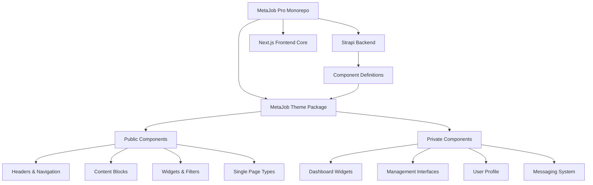

# MetaJob Theme - Dynamic Component System

A sophisticated theme system for the **MetaJob** full-stack job board solution. This package provides a dynamic component mapping architecture that works seamlessly with Strapi CMS backend and Next.js frontend, similar to WordPress theme systems.

## 🏗️ Architecture Overview



## 🎨 Features

- **Dynamic Component Resolution** - Components resolved by string identifiers from Strapi
- **Public/Private Component Split** - Separate component sets for authenticated and public users
- **Headless CMS Integration** - Seamless integration with Strapi backend
- **TypeScript Support** - Fully typed components for better development experience
- **Responsive Design** - Mobile-first design that works on all devices
- **Theme Customization** - Easy to customize colors, fonts, and layouts
- **Optimized Performance** - Built with Next.js best practices

## 📦 Installation & Setup

This theme is part of the MetaJob monorepo and is **not available as a standalone package**. It's designed to work within the MetaJob ecosystem.

### Development Setup

```bash
# Clone the MetaJob repository
git clone https://github.com/your-username/metajob-pro.git
cd metajob-pro

# Install dependencies
pnpm install

# Start development
pnpm dev
```

## 🧩 Component Architecture

The theme uses a **dynamic component mapping system** where components are resolved by string identifiers, allowing Strapi to control which components are rendered on each page.

### Component Export Structure

```typescript
// Two main exports from index.tsx
export const getPublicComponents = {
  // Components available to all users
}

export const getPrivateComponents = {
  // Components available to authenticated users only
}
```

## 📋 Available Components

### Public Components (28 total)

#### Headers & Navigation (4 components)
- `header.breadcrumbs` - Breadcrumb navigation
- `header.top-bar` - Top navigation bar
- `header.header-bottom` - Bottom header section
- `header.main-menu` - Main navigation menu

#### Content Blocks (15 components)
- `metajob-block.page-header` - Page title and header
- `metajob-block.job-banner` - Job search banner
- `metajob-block.job-category` - Job category display
- `metajob-block.job-category-overlay` - Category with overlay
- `metajob-block.job-card` - Individual job listing
- `block.blog-card` - Blog post card
- `block.review-block` - Review/testimonial block
- `metajob-block.public-package` - Pricing packages

#### Filters & Search (6 components)
- `block.job-filter` - Job search filters
- `metajob-block.job-filter` - Enhanced job filters
- `metajob-block.company-filter` - Company search filters
- `metajob-block.candidate-filter` - Candidate filters
- `block.blog-filter` - Blog post filters
- `metajob-block.category-filter` - Category filters

#### Widgets (3 components)
- `widget.contact-widget` - Contact information
- `widget.menu-widget` - Menu/navigation widget
- `widget.copyright-bar` - Copyright footer

#### Single Page Types (4 components)
- `metajob-single-type.job-details` - Job detail page
- `metajob-single-type.company-details` - Company profile page
- `metajob-single-type.resume-details` - Resume/CV page
- `single-type.blog-details` - Blog post detail page

### Private Components (17 total)

#### Dashboard Widgets (9 components)
- `widget.total-job` - Total jobs counter
- `widget.open-job` - Open jobs counter
- `widget.closed-job` - Closed jobs counter
- `widget.applied-list` - Applied jobs list
- `widget.favorite-list` - Favorite jobs list
- `block.bookmark-list` - Bookmarked items
- `block.recent-activities` - Recent activity feed
- `block.notification-list` - Notifications list
- `shared.spacing` - Layout spacing component

#### Management Interfaces (6 components)
- `metajob-block.bookmark` - Bookmark management
- `metajob-block.applied-jobs` - Applied jobs management
- `metajob-block.manage-resume` - Resume management
- `metajob-block.manage-company` - Company management
- `metajob-block.manage-job` - Job posting management
- `metajob-block.manage-packages` - Package management

#### User & Communication (2 components)
- `block.auth-profile` - User profile management
- `metajob-config.message` - Messaging system

## 🚀 Usage in MetaJob

### Component Resolution

Components are dynamically resolved based on Strapi content structure:

```typescript
// Example: Strapi returns component identifier
const componentKey = "metajob-block.job-card"

// Theme resolves component from mapping
const Component = getPublicComponents[componentKey]?.component

// Render with data from Strapi
<Component {...dataFromStrapi} />
```

### Page Building

Pages are built by combining multiple components defined in Strapi:

```typescript
// Strapi page structure
{
  "components": [
    {
      "__component": "metajob-block.page-header",
      "title": "Find Your Dream Job"
    },
    {
      "__component": "metajob-block.job-banner",
      "searchPlaceholder": "Search jobs..."
    },
    {
      "__component": "metajob-block.job-card",
      "jobs": [...jobData]
    }
  ]
}
```

## 📁 Project Structure

```
packages/metajob-theme/src/
├── blocks/                 # Content blocks
│   ├── job-card/          # Job listing components
│   ├── job-filter/        # Search and filter components
│   ├── page-header/       # Page headers
│   └── ...
├── widgets/               # Sidebar widgets
│   ├── total-job/         # Job counters
│   ├── contact-widget/    # Contact information
│   └── ...
├── single-type/           # Detail pages
│   ├── job-details/       # Job detail page
│   ├── company-details/   # Company profile
│   └── ...
├── components/            # Shared UI components
│   ├── common/           # Common utilities
│   ├── cards/            # Card components
│   └── ...
├── shared/               # Shared utilities
├── form/                 # Form components
├── lib/                  # Utility libraries
├── types/                # TypeScript definitions
└── index.tsx             # Main export file
```

## 🎨 Customization

### Theme Variables

The theme supports customization through CSS custom properties and theme configuration:

```css
:root {
  --metajob-primary: #3B82F6;
  --metajob-secondary: #10B981;
  --metajob-accent: #F59E0B;
  --metajob-background: #FFFFFF;
  --metajob-text: #1F2937;
}
```

### Component Styling

Each component can be customized through:
- CSS custom properties
- Theme configuration
- Component-specific styling
- Material-UI theme overrides

## 🔧 Development Guidelines

### Adding New Components

1. Create component in appropriate directory (`blocks/`, `widgets/`, `single-type/`)
2. Add to component mapping in [`index.tsx`](packages/metajob-theme/src/index.tsx:1)
3. Define corresponding Strapi component schema
4. Add TypeScript definitions

### Component Naming Convention

- **Headers**: `header.*`
- **Content Blocks**: `block.*` or `metajob-block.*`
- **Widgets**: `widget.*`
- **Single Types**: `single-type.*` or `metajob-single-type.*`
- **Filters**: `filter.*`
- **Management**: `manage.*`

## 🔗 Integration with Strapi

This theme is tightly integrated with the MetaJob Strapi backend:

1. **Component Definitions** - Strapi defines available components
2. **Dynamic Rendering** - Pages built from Strapi component data
3. **Content Management** - All content managed through Strapi admin
4. **API Integration** - Components fetch data from Strapi APIs
5. **User Authentication** - Integrated with Strapi user system

## 🛠️ Technical Requirements

- **Node.js** (v18 or higher)
- **Next.js** 13+
- **React** 18+
- **TypeScript** 4.9+
- **Material-UI** 5+
- **Strapi** 4+

## 📄 License

- ✅ **FREE for Personal Use** - Learning, development, personal projects
- 💼 **Commercial License Required** - Business use, client projects, revenue-generating apps

**Get Commercial License:** [MetaJob Commercial License](https://jstemplate.net/item/job-board-app-with-nextjs-strapi)

## 🔗 Related Packages

- **MetaJob Core** - Complete full-stack job board solution
- **MetaJob Backend** - Strapi CMS backend for job management

## 📞 Support

- **Documentation:** [MetaJob Docs](https://docs.jstemplate.net/metajob/)
- **Issues:** [GitHub Issues](https://github.com/your-username/metajob-pro/issues)
- **Email:** [info@jstemplate.net](mailto:info@jstemplate.net)

## 🌟 Show Your Support

If this theme helps you build amazing job board applications, please ⭐ star this repo!

---

**Built with ❤️ for the developer community**
